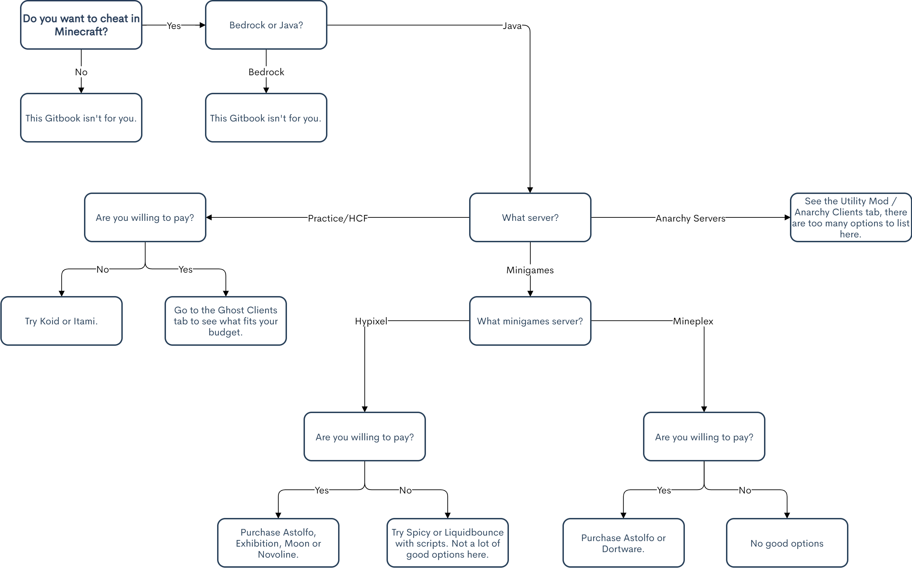

# Choosing a Cheat

## What do you want?

**Blatant Clients:** This depends on the server you're choosing. You will find a lot of blatant clients under the Blatant Clients tab, however some may not fit your needs. You can look under the title of the cheat to find out it's focus \(i.e. "Primarily Hypixel"\), and if it isn't what you're looking for, you can go onto the next.

**Ghost Clients:** This one is a little less tricky. While most cheats are _meant_ for potpvp servers, they will usually bypass well on minigames servers such as Hypixel or Mineplex.

**Anarchy Clients / Utility Mods:** This category of cheating is probably the easiest to find a cheat for. Utility mods usually bypass a lot of servers, however some may have specific bypasses for some servers \(i.e. 2b2t\).

## **Common Mistakes**

**Do research when choosing a cheat!**

Always do research before you choose a cheat. Your friend, a YouTuber, someone on Reddit, or anyone might give you a recommendation, however it's a good idea to fact check. You should always look up the cheats people talk about, see actual reviews of them, and see if that cheat is the one for you. We also recommend you go beyond just this gitbook to research a cheat.

**Clients have limits.**

Minecraft limits what the client can do. A client can't magically give you OP on a server, put you in creative mode, give you items, etc. Things like creative mode \(along with the others previously mentioned + more\) are handled server side, where things like movement, rendering, etc. are handled client side. Clients that claim to do something that's handled server side are a scam, and they could have malicious intent \(ratting you, installing a trojan, etc.\) and should **not** be trusted. If you have any questions about what is handled client/server side, or if a module is possible, you can always create a post on our subreddit.

**Montages shouldn't be considered when purchasing a cheat.**

The whole point of a montage is to pick your best clips with the client, edit them, and show them off. The client might usually do terrible, but if someone can get a few lucky clips with it they can make it look amazing - which is why montages shouldn't be considered when choosing a cheat. You should also keep in mind the date the montage or video was made, as something that was good in 2019 might not be as good in 2021.

**Just because a client flags your antivirus doesn't mean it is a virus.**

It is extremely common for clients to flag antiviruses. Ghost clients are notorious for this, as they practically replicate what a trojan does \(inject itself into a program and then hide all traces of it\). However, blatant clients and utility mods might also flag the antivirus. For example, obfuscation is known for making flagging antiviruses, and some client's \(like Astolfo\) have launchers that flag antiviruses. While a client _usually_ isn't a virus/rat, cracks most likely are. You should always research any client you use just in case.

## Purchase Guide \(Flowchart\)

