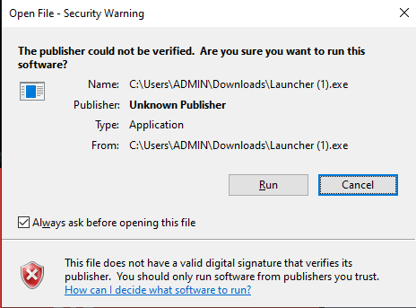

# How to install.

How to install after purchasing.

1. Disable windows defender. You can do this in 2 ways, you can either use [defendercontrol ](https://mega.nz/file/XVBXyayJ#30-yWtB_x0_m5in1y4iGSbOMRJ-ZAixYzVrVyzYF2gw)or you can do it manually.
2. Go to the forums 

3. Click client download

4. Click download this file

5. Run the exe file \(it says \(4\) for me because i have downloaded it a shit ton of times due to forgetting to do step 1\) \( it says canceled for me because i didnt need a 4th copy of astolfo\)

6. Click run 

7. Login with your forums account

8. Click launch

